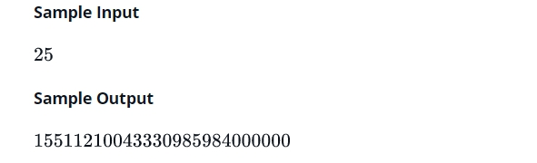

# 25 的乘階（25!）怎麼算 ?

<br>

今天跟同學討論一個問題，25 的乘階要怎麼算 ? 最直接的想法就是 `25*24*23*...*2*1` 這樣徒法煉鋼。但是問題出現了，就算徒法煉鋼，最後的結果也會因為數字太大而溢位，結果為 : `15511210043330985984000000`。

這一篇筆記就來解答一下算法吧！

<br>

------

<br>

## 原題

輸入整數值 n，其取值範圍 : 1 < n < 100,請設計出演算法可以印出 n 的乘階（n!）答案。

舉例 : 



<br>
<br>

## 解題思維

* 首先我的想法是，既然會溢位，那麼一定不可能是以 int 甚至 long 的型態印出來答案（n = 100 時 long 也不夠長）。所以我會想用 String 來當最終輸出結果。

<br>

* 既然會有溢位情況產生，那麼計算上絕對不可以直接 `int*int` 或 `long*long`，我想到的方法是，那就用我們人類的計算思維去算。

    我們人類思維算 243 * 23 的方式是:

    ```
    243 * 3 = 729 // 72 進位，9 留在個位上
    243 * 2 = 468 // 468 加上進位的 72 等於 558，8 留在十位上，55 進位

    最終結果 = 5589
    ```

    我們人類的乘法思維相當於把一個乘數拆成陣列，另一個乘數分別去一一乘上每個陣列原素，每次乘的時候記得把上一輪的進位數加上，保留結果的個位數，然後把 10 位以上拿去進位。

    看不懂沒關係，你就仔細想一下你手算乘法怎麼算，我們就怎麼去設計演算法。

<br>
<br>

## 實作

* 來到實作啦，先寫一下測試吧 :

    Tester.java : 

    ```java
    import org.junit.Test;
    import static org.junit.Assert.assertEquals;

    public class Tester {
        @Test
        public void run(){
            Factorial factorial = new Factorial();
            String answer = factorial.calculate(25);
            System.out.println("計算答案: " + answer);
            assertEquals("15511210043330985984000000", answer);
        }
    }
    ```

    我們就是要把 Factorial 類別設計出來，測到綠就算結束。

    <br>

* 設計 Factorial 類別 :

    首先我們把流程先訂一下 :

    ```java
    public class Factorial {
    // 1
    private List<Integer> numBuffer = new ArrayList<>();

    public String calculate(int target){
        putNumToLastOfNumBuffer(target); // 2

        for (int i = target - 1; i > 0; --i){
            System.out.println("正在乘: " + i);
            multiplyWithCurrentNumBuffer(i);
            System.out.println("當前 numNuffer: " + numBuffer);
        }
    }
    ```

    <br>

    __註解一__ : `numBuffer` 就是我們乘階答案的暫存區。例如 `30*29*28*...`，這邊會先把 30 乘 29 的結果 870 以反轉的方式切片放入 `numBuffer`，也就是 `[0, 7, 8]`，輪到 28 時，`0*28=0` 跳過， `7*28=196` 6 留下 19 進位，`8*28+19=243` 3 留下 24 進位，然後我們得到 : `[0, 6, 3, 4, 2]`。

    <br>

    __註解二__ : `putNumToLastOfNumBuffer()` 的作用是 : 當數字進到 func 之後，我們先把他放到 `numBuffer` 裡，記得要反轉喔！ ex: 30 -> `[0, 3]`

    剩下就是算乘階了。實作細節放在下面，如果需要可以參考。

    <br>

    [__看完整範例點這裡 （Factorial.java）__](./Factorial.java)


