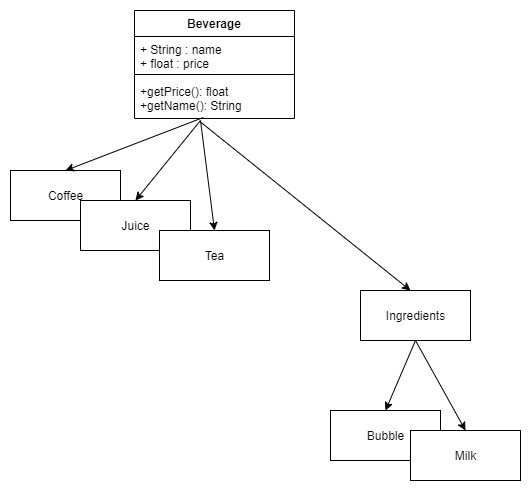

# 裝飾器設計模式

<br>

裝飾器設計模式最有名的應用例子，就是 __Java__ 的 __IO API__ 了。本篇將介紹如何設計一個裝飾器模式的架構。

<br>
<br>

---

<br>
<br>

## 目錄

* [裝飾器範例說明（Java IO API）](#io)

* [自製 Java IO 裝飾器](#diy)

* [裝飾器應用場景 : 飲料店](#drink)

<br>
<br>

---

<br>
<br>

<div id="io">

## 裝飾器範例說明（Java IO API）

* 直接先看 code : 

    ```java
    public static void main(String[] args) {
        try(BufferedReader reader = new BufferedReader(new InputStreamReader(System.in))){
            String quest = reader.readLine();
            System.out.println(quest);
        } catch (IOException e) {
            e.printStackTrace();
        }
    }
    ```

    其中 `reader` 的建立就是使用裝飾器設計模式設計的。不要覺得 Java 的 IO API 很難用，實際理解裝飾器設計模式之後，就清楚這樣設計的精妙之處。

    裝飾器設計模式事實上可以白話一點理解就是在物件建立的過程中 __不斷地附加功能__，就像上面的 `reader` 建立過程，從 `System.in` 這個基本的 `InputStream` 附加了 `InputStreamReader` 的字元處理，再來又附加了 `BufferedReader` 這個緩衝區處理功能。

    如果今天我們不想使用 `BufferedReader` 提供的緩衝區功能，我們可以放心的去掉他 : 

    ```java
    public static void main(String[] args) {
        try(InputStreamReader reader = new InputStreamReader(System.in)){
            char[] box = new char[10];
            reader.read(box);
            System.out.println(box);
        } catch (IOException e) {
            e.printStackTrace();
        }
    }
    ``` 

    JDK 設計人員如此設計 IO API 為使用者們提供靈活的組合運用。甚至我們也可以自己設計一個 __IO 裝飾器__。這將在下個單元提到。
    

<br>
<br>

---

<br>
<br>

<div id="diy">

## 自製 Java IO 裝飾器

* Java IO 提供一個可擴充的抽象類別 `FilterReader`，我們可以盡情的繼承這個類別實現自己的 `Reader`。

* 話不多說，直接實現一個自動轉大寫的 `Reader` 吧 : 

    ```java
    public class UpperCaseReader extends FilterReader {

        public UpperCaseReader(Reader in) {
            super(in);
        }

        @Override
        public int read(){
            int box = this.read();
            return box != -1 ? (char) Character.toUpperCase(box) : box;
        }

        @Override
        public int read(char cbuf[], int off, int len) throws IOException {
            int ans = in.read(cbuf, off, len);
            for (int i = 0; i < cbuf.length; ++i){
                cbuf[i] = Character.toUpperCase(cbuf[i]);
            }
            return ans;
        }
    }
    ```

    <br>

* 按照裝飾器使用方法直接擴充使用 : 

    ```java
    public static void main(String[] args) {
            try(BufferedReader reader = new BufferedReader(new UpperCaseReader((new InputStreamReader(System.in))))){
                String a = reader.readLine();
                System.out.println(a);
            } catch (IOException e) {
                e.printStackTrace();
            }
        }
    ```

<br>
<br>

---

<br>
<br>

<div id="drink">

## 裝飾器應用場景 : 飲料店

* 需求分析 : 

    今天我們要幫一間飲料店設計一套訂單系統，要求可以根據客人點單的飲料基底加上選料算出價格以及品名。

    我們使用裝飾器設計模式設計一套飲料訂單系統。

<br>

* 飲料機底設計 :

    飲料店共有 3 種基底 `Coffee`、`Juice`、`Tea`。這三個類別繼承同一個抽象類別 `Beverage`

    

    

    <br>

    [`Beverage.java`](./Decorator/base/Beverage.java) :

    ```java
    public abstract class Beverage {
        protected String name;
        protected float price;
        protected String description;

        public abstract float getPrice();

        public abstract String getName();
    }
    ```

    <br>

    子類 3 種基底分別繼承 `Beverage` :

    [`Coffee.java`](./Decorator/base/Coffee.java)

    ```java
    public class Coffee extends Beverage {
        public Coffee(){
            name = "咖啡";
            price = 55f;
            description = "頂級古巴咖啡豆研磨";
        }

        @Override
        public float getPrice() {
            return this.price;
        }

        @Override
        public String getName() {
            return this.name;
        }
    }
    ```

    其餘略 : 
    
    [`Tea.java`](./Decorator/base/Tea.java)

    [`Juice.java`](./Decorator/base/Juice.java)

<br>

* 選料設計 :

    目前提供的選料有 2 種，珍珠跟牛奶。選料的部分也算做是一種飲料，所以也都要繼承 `Beverage` 並實現 `getPrice()` 與 `getName()` 這兩個方法。

    因為每一種選料的部分 `getPrice()` 與 `getName()` 邏輯相同，所以我們提出一個父類別預設實現這兩個方法。就叫做 `Ingredients` 吧，所以現在架構如下 : 

    

    <br>


    [`Ingredients.java`](./Decorator/decorator/Ingredients.java)

    ```java
    public class Ingredients extends Beverage {
        protected Beverage beverage;

        @Override
        public float getPrice() {
            return this.price + this.beverage.getPrice();
        }

        @Override
        public String getName() {
            return this.name + this.beverage.getName();
        }
    }
    ```

    <br>

    Ingredients 的子類別 : 

    [`Bubble.java`](./Decorator/decorator/Bubble.java)

    ```java
    public class Bubble extends Ingredients {
        public Bubble(Beverage beverage){
            this.beverage = beverage;
            this.price = 5f;
            this.name = "珍珠";
            this.description = "古早味粉圓";
        }
    ```

    [`Milk.java`](./Decorator/decorator/Milk.java)

    ```java
    public class Milk extends Ingredients {
        public Milk(Beverage beverage){
            this.beverage = beverage;
            this.price = 10f;
            this.name = "奶";
            this.description = "高級牛奶";
        }
    }
    ```

    <br>

* 實際使用 :

    [`Main.java`](./Decorator/Main.java)

    來做一杯珍奶吧 ~XD

    ```java
    public class Main {
        public static void main(String[] args) {
            Beverage bubbleMilkTea = new Bubble(new Milk(new Tea()));
            System.out.println("名稱 : " + bubbleMilkTea.getName());
            System.out.println("價格 : " + bubbleMilkTea.getPrice());

        }
    }
    ```


