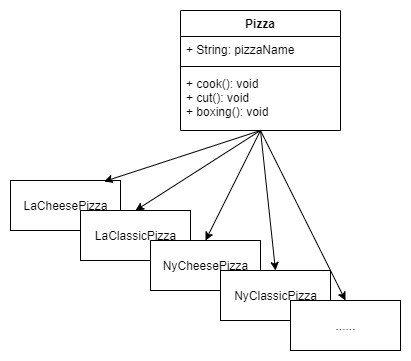
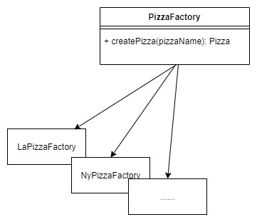
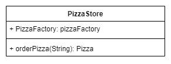

# 工廠模式

<br>

* 本篇來談談 OO 設計中的工廠模式，使用 Pizza Hott 舉例。

* [查看 source code 請點這裡](./factorypattern)

<br>

-----

<br>
<br>

## 介紹

物件導向設計準則有提到 : __不要針對具體物件編寫程式，要針對介面編寫__。比如說今天我們有很多種類 __Pizza__，我們應該先要使用介面（or 抽象類）來界定 Pizza 的一些基本屬性或行為。例如 : 

```java

public interface Pizza {
    ...
}

public class BeefCheesePizza implements Pizza {
    ...
}

public class HotDogPizza implements Pizza {
    ...
}
```

基於以上類別結構關係設計，正確的物件建立使用方式為 : 

```java
Pizza pizza1 = new BeefCheesePizza();
Pizza pizza2 = new HotDogPizza();
```

不建議的使用方式為 （再沒有 implements 統一介面情況下） :

```java
BeefCheesePizza pizza1 = new BeefCheesePizza();
HotDogPizza pizza2 = new HotDogPizza();
```

<br>

但是談到實際上程式的運行階段，不可能避免要 `new` 出物件來使用。如果今天系統中有很多種類 Pizza，而我們要根據使用者點單來動態建立 Pizza 物件，勢必要這樣編寫 : 

```java

Pizza pizza;
if (hotdog) {
    pizza = new HotdogPizza();
} else if (beef) {
    pizza = new BeefCheesePizza();
} else{
    pizza = new DefaultPizza();
}
return pizza;
```

<br>

所以問題出現了 : __有沒有辦法可以更加靈活的管理物件建立的方法呢 ?__ 這就是本篇工廠模式要解決的問題。

<br>
<br>

------------------------

<br>
<br>


## 需求分析

同樣來一個假的需求吧 : 有一間披薩店，要做一個點單出貨系統，要求不同地區的分店可以有自己口味的 Pizza，而且烹調包裝方式也可以靈活變動。

跟上面提到的 OO 設計準則一樣，我們要先定義一個抽象父類別 `Pizza`，再來我們任何地區的任何口味的 Pizza 都要繼承這個 `Pizza` 類別。



<br>

接下來，我們要設計 Pizza 工廠了，Pizza 工廠主要負責工作是生產出每一個地區獨有的 Pizza，可以先建立一個抽象父類別 `PizzaFactory` 然後讓每一個地區的 Pizza 工廠繼承這個基本的 Pizza 工廠。



<br>

最後就是我們的實體店面了。店面負責收到顧客下的單（Pizza 名稱），然後轉交給當地的 Pizza 工廠去生產 Pizza，最後針對 `Pizza` 進行 `cook`、`cut`、`boxing` 的動作後再把 Pizza 交給顧客。



<br>
<br>

---

<br>
<br>

## 實作

* 定義 Pizza 抽象父類別 : 

    [Pizza.java](./factorypattern/pizzahott/product/Pizza.java)

    ```java
    public abstract class Pizza {

        protected String pizzaName;

        public void cook(){
            System.out.println(String.format("製做 %s ..", this.pizzaName));
        }

        public void cut(){
            System.out.println("切塊..");
        }

        public void boxing(){
            System.out.println("封裝入盒..");
        }
    }
    ```

<br>
<br>

* 定義各式各樣的子類 Pizza : 

    [LaCheesePizza.java](./factorypattern/pizzahott/product/LaCheesePizza.java)

    ```java
    public class LaCheesePizza extends Pizza {
        LaCheesePizza(){
            this.pizzaName = "洛杉磯起司披薩";
        }
    }
    ```

    [LaClassicPizza.java](./factorypattern/pizzahott/product/LaClassicPizza.java)

    ```java
    public class LaClassicPizza extends Pizza {
        LaClassicPizza(){
            this.pizzaName = "洛杉磯經典披薩";
        }
    }
    ```

    [LaSeaFoodPizza.java](./factorypattern/pizzahott/product/LaSeaFoodPizza.java)

    ```java
    public class LaSeaFoodPizza extends Pizza {
        LaSeaFoodPizza(){
            this.pizzaName = "洛杉磯海鮮披薩";
        }
    }
    ```

    [NyCheesePizza.java](./factorypattern/pizzahott/product/NyCheesePizza.java)

    ```java
    public class NyCheesePizza extends Pizza {
        NyCheesePizza(){
            this.pizzaName = "紐約起司披薩";
        }
    }
    ```

    [NyClassicPizza.java](./factorypattern/pizzahott/product/NyClassicPizza.java)

    ```java
    public class NyClassicPizza extends Pizza {
        NyClassicPizza(){
            this.pizzaName = "紐約經典披薩";
        }
    }
    ```

    [__NySeaFoodPizza.java__](./factorypattern/pizzahott/product/NySeaFoodPizza.java)

    ```java
    public class NySeaFoodPizza extends Pizza {
        NySeaFoodPizza(){
            this.pizzaName = "紐約起司披薩";
        }

        @Override
        public void cut(){
            System.out.println("切成方塊狀..");
        }
    }
    ```

    <br>

    以上只有 NySeaFoodPizza 比較特別一點，因為他要切成方塊狀...

    <br>
    <br>

* 定義抽象父類別 `PizzaFactory` : 

    [PizzaFactory](./factorypattern/pizzahott/factory/PizzaFactory.java)

    ```java
    public interface PizzaFactory {
        Pizza createPizza(String type);
    }
    ```

    <br>
    <br>

* 定義洛杉磯跟紐約的 Pizza 工廠，繼承 `PizzaFactory` 這個抽象類 : 


    [LaPizzaFactory](./factorypattern/pizzahott/product/LaPizzaFactory.java)

    ```java
    public class LaPizzaFactory extends Pizza implements PizzaFactory {
        @Override
        public Pizza createPizza(String type) {
            if (type.equals("起司")){
                return new LaCheesePizza();
            }
            if (type.equals("海鮮")){
                return new LaSeaFoodPizza();
            }
            return new LaClassicPizza();
        }
    }
    ```

    [NyPizzaFactory](./factorypattern/pizzahott/product/NyPizzaFactory.java)

    ```java
    public class NyPizzaFactory implements PizzaFactory {
        @Override
        public Pizza createPizza(String type) {
            if (type.equals("起司")){
                return new NyCheesePizza();
            }
            if (type.equals("海鮮")){
                return new NySeaFoodPizza();
            }
            return new NyClassicPizza();
        }
    }
    ```

<br>
<br>

* 快到尾聲了，該定義我們的店面了。實作  `PizzaStore` :

    [PizzaStore.java](./factorypattern/pizzahott/PizzaStore.java)

    ```java
    public class PizzaStore {

        protected PizzaFactory pizzaFactory;

        public PizzaStore(PizzaFactory factory){
            this.pizzaFactory = factory;
        }

        public Pizza orderPizza(String type){
            System.out.println("收到訂單");
            Pizza pizza = this.pizzaFactory.createPizza(type);
            pizza.cook();
            pizza.cut();
            pizza.boxing();
            return pizza;
        }
    }
    ```

<br>
<br>

* 最後就輪到執行了 `Main`

    [Main.java](./factorypattern/Main.java)

    ```java
    public class Main {
        public static void main(String[] args) {
            PizzaStore nyStore = new PizzaStore(new NyPizzaFactory());
            nyStore.orderPizza("海鮮");

            PizzaStore laStore = new PizzaStore(new LaPizzaFactory());
            laStore.orderPizza("海鮮");


        }
    }
    ```