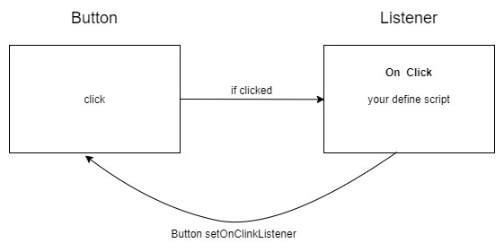
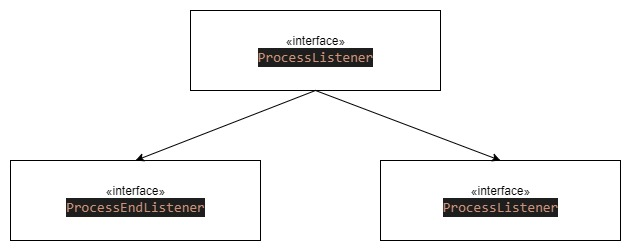

#   

# 製作 Listener 架構

<br>

使用一些框架的時候經常會使用到 `Listener`，例如 __Android__ 或 __Swing__ 裡面經常出現的 `EventListener` 。


事實上，Listener 設計架構的背後是所謂的 __觀察者模式__  。本篇筆記就來實作一下 Linstener 架構吧。


<br>


---


<br>


##  目錄


1. [觀察者模式介紹](#obs)

3. [Listener 是甚麼 ?](#listener)

2. [製作 TaskProcessor](#tp)


<br>

---


<br>

<div id="obs"></div>


## 觀察者模式介紹

* __甚麼是觀察者模式 ?__

    舉生活上的例子就是 youtube 訂閱。A 是一個 youtuber，B 跟 C 是觀眾。B 跟 C 可以選擇訂閱 A ，這樣一來，B 跟 C 就不用自己去 A 的頻道查看有沒有新的影片了。只要 A 更新新影片，A 就會把新影片上架的消息按照 __訂閱者清單__ 發送給所有訂閱者。

    

    <br>

* __簡易實作__

    現在，我們要實作一個 Youtuber 與 Subscriber 之間進行訂閱、退訂以及消息發送的功能。

    * 首先實作 [Youtuber.java](./Observer/Youtuber.java) : 

        ```java
        public class Youtuber {

            private String name;

            private List<Subscriber> subscriberList = new ArrayList<>();

            public Youtuber(String name){
                this.name = name;
            }

            public String getName(){
                return this.name;
            }

            public void addSubscriber(Subscriber subscriber){
                this.subscriberList.add(subscriber);
            }

            public void removeSubscriber(Subscriber subscriber){
                this.subscriberList.remove(subscriber);
            }

            public void publishVideo(String viedoName){
                this.subscriberList.forEach(subscriber -> subscriber.noticed(this, viedoName));
            }
        }
        ```

        __Youtuber.java__ 有三個者主要方法，`addSubscriber()`、`removeSubscriber()`、`publishVideo()`，具體功能不多說，相信看到 func name 就能推測出是做甚麼的了。
        
        當有新影片發布時，可以呼叫 `publishVideo()` 方法，此方法會尋遍所有訂閱者，並觸發訂閱者的 `noticed()` 方法。

        <br>

    * 再來我們製作 [Subscriber.java](./Observer/Subscriber.java) : 

        ```java
        public class Subscriber {

            private String name;

            private List<Youtuber> subscribeList = new ArrayList<>();

            public Subscriber(String name){
                this.name = name;
            }

            public void noticed(Youtuber youtuber, String videoName){
                System.out.println(String.format("%s 收到新消息 : %s 發布了新影片，<%s>",this.name, youtuber.getName(), videoName));
            }

            public void subscribe(Youtuber youtuber){
                youtuber.addSubscriber(this);
                this.subscribeList.add(youtuber);
            }

            public void cancelSubscribe(Youtuber youtuber){
                youtuber.removeSubscriber(this);
                this.subscribeList.remove(youtuber);
            }
        }
        ```

        實作完以上 `Subscriber.java` 之後建議細細品味。到目前為止我們已經實現了一個簡單的觀察者模式的設計架構。

        <br>

    * 最後來看看 [Main.java](./Observer/Main.java) : 

        ```java
        public class Main {
            public static void main(String[] args) {
                Youtuber oldKao = new Youtuber("老高");
                Subscriber johnny = new Subscriber("強尼");
                Subscriber betali = new Subscriber("貝塔里");

                johnny.subscribe(oldKao);
                betali.subscribe(oldKao);

                oldKao.publishVideo("外星人");

            }
        }
        ```

<br>
<br>

-----------------

<br>
<br>

<div id="listener">

## Listener 是甚麼 ?

Listener 在我們用的很多套件或框架中都有出現過，最常見的莫過於 Android 的一些 event listener，例如 `ButtonListener` : 建立一個監聽器，在 Button 被點擊時觸發 Listener 中的腳本 : 



<br>

事實上，Listener 就是一種觀察者模式的應用設計架構。接下來就要來實際設計一個簡易的 Listener 應用架構。


<br>
<br>

-----------------

<br>
<br>

<div id="tp">

## 製作 TaskProcessor

* 需求分析 : 我們要做一個 __任務執行器__。當任務完成時，此任務執行器要通知所有的 `EndListener` 說明任務已經圓滿完成。當有錯誤發生時，也通知所有的 `ExceptionListener` 告知有錯誤發生。

* 定義一個抽象的 TaskProcessor 類別 [AbstractTaskProcessor.java](./Listener/processor/AbstractTaskProcessor.java) : 

    ```java
    public abstract class AbstractTaskProcessor {
        
        // Ending 監聽器註冊列表
        List<ProcessorEndListener> endListeners = new ArrayList<>();
        // Exception 監聽器註冊列表
        List<ProcessorExceptionListener> exceptionListeners = new ArrayList<>();

        final public void addEndListener(ProcessorEndListener listener){
            this.endListeners.add(listener);
        }

        final public void addExceptionListener(ProcessorExceptionListener listener){
            this.exceptionListeners.add(listener);
        }

        final public void removeListener(ProcessListener listener){
            if (listener instanceof ProcessorEndListener){
                this.endListeners.remove(listener);
                return;
            }
            if (listener instanceof ProcessorExceptionListener){
                this.exceptionListeners.remove(listener);
            }
        }

        /** 
         * 抽象方法，子類別繼承之後可以 Override 編寫自己的任務腳本
         **/
        public abstract void run();

        /** 
         * 這邊指定運行邏輯，在 run() 結束之後通知列表中所有 endListeners，
         * 當錯誤發生時，會通知所有 exceptionListeners，若沒有任何 exceptionListeners，
         * 則正常拋出錯誤。
         **/
        final public void start(){
            try {
                run();
                endListeners.forEach(ProcessorEndListener::noticed);
            } catch (Exception ex){
                if (this.exceptionListeners.size() > 0) {
                    exceptionListeners.forEach(listener -> listener.noticed(ex));
                } else{
                    throw ex;
                }

            }
        }
    }
    ```

    <br>
    <br>

* 定義介面 `ProcessListener` 與其兩個子介面 `ProcessEndListener`、`ProcessExceptionListener`

    

    * [ProcessListener.java](./Listener/listener/ProcessListener.java)

        ```java
        public interface ProcessListener<T extends AbstractTaskProcessor> {
            T getProcessor();
        }
        ```

    * [ProcessorEndListener.java](./Listener/listener/ProcessorEndListener.java)

        ```java
        public interface ProcessorEndListener extends  ProcessListener<AbstractTaskProcessor> {
            void noticed();
        }
        ```

    * [ProcessorExceptionListener.java](./Listener/listener/ProcessorExceptionListener.java)

        ```java
        public interface ProcessorExceptionListener extends ProcessListener<AbstractTaskProcessor> {
            void noticed(Exception ex);
        }
        ```

        <br>
        <br>

* 因為我覺得 `ProcessListener` 介面定義的 `getProcessor()` 方法可以預設一個共同實現，所以這邊我寫了兩個抽象的 `ProcessorEndListener`、`ProcessorExceptionListener` 類別，為了統一定義 `getProcessor()` 方法。

    * [AbstractProcessorEndListener.java](./Listener/listener/AbstractProcessorEndListener.java)

        ```java
        public abstract class AbstractProcessorEndListener implements ProcessorEndListener {

            AbstractTaskProcessor processor;

            public AbstractProcessorEndListener(AbstractTaskProcessor processor){
                this.processor = processor;
            }

            @Override
            public AbstractTaskProcessor getProcessor(){
                return this.processor;
            }

        }
        ```


    * [AbstractProcessorExceptionListener.java](./Listener/listener/AbstractProcessorExceptionListener.java)

        ```java
        public abstract class AbstractProcessorExceptionListener implements ProcessorExceptionListener {
            AbstractTaskProcessor processor;

            public AbstractProcessorExceptionListener(AbstractTaskProcessor processor){
                this.processor = processor;
            }

            @Override
            public AbstractTaskProcessor getProcessor(){
                return this.processor;
            }
        }
        ```

        <br>
        <br>

* 實際使用 : 

    * 定義 [MyTaskProcessor.java](./Listener/MyTaskProcessor.java) :

        ```java
        public class MyTaskProcessor extends AbstractTaskProcessor {
            @Override
            public void run() {
                IntStream.range(1, 10).forEach(i -> {
                    if (i == 4){
                        //throw new RuntimeException("opopopop error happened..");
                    }else{
                        System.out.println(i);
                    }
                });
            }
        }
        ```

        <br>

    * 定義 [Main.java](./Listener/Main.java) : 

        ```java
        public class Main {

            private static class MyTaskProcessorEndListener extends AbstractProcessorEndListener {

                public MyTaskProcessorEndListener(AbstractTaskProcessor processor) {
                    super(processor);
                }

                @Override
                public void noticed() {
                    System.out.println("ProcessorEndListener : 處理結束..");
                }
            }

            private static class MyTaskProcessorErrorListener extends AbstractProcessorExceptionListener {

                public MyTaskProcessorErrorListener(AbstractTaskProcessor processor) {
                    super(processor);
                }

                @Override
                public void noticed(Exception ex) {
                    System.out.println("ProcessorErrorListener : oop ! 遇到錯誤了..");
                }
            }

            public static void main(String[] args) {
                MyTaskProcessor processor = new MyTaskProcessor();
                ProcessorEndListener myEndListener = new MyTaskProcessorEndListener(processor);
                ProcessorExceptionListener myErrListener = new MyTaskProcessorErrorListener(processor);

                processor.addEndListener(myEndListener);
                processor.addExceptionListener(myErrListener);
                processor.addExceptionListener(myErrListener);

                processor.removeListener(myErrListener);
                processor.removeListener(myErrListener);
                processor.removeListener(myEndListener);

                processor.start();
            }
        }
        ```