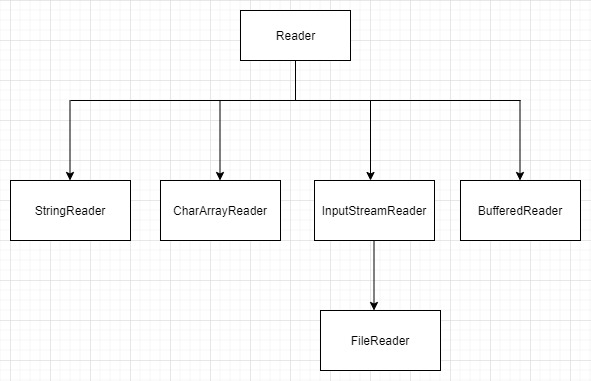
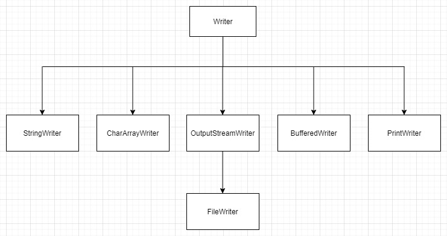

# `Reader` & `Writer` 繼承架構

<br>

瞭解 `Reader` & `Writer` 繼承架構更利於靈活運用 API。

<br>

## `Reader` 繼承架構



<br>
<br>

## `Writer` 繼承架構



<br>
<br>

## 簡介

* `FileReader` 是 `Reader` 具體的實現，用於讀檔並把 byte 資料轉成字元資料。使用 OS 預設編碼做字元轉換。

* `FileWriter` 是 `Writer` 具體的實現，用於把字元資料寫入到文件。使用 OS 預設編碼做字元轉換。

* 在啟動 JVM 時，可以指定 `FileReader` 與 `FileWriter` 使用的編碼 :

    ```bash
    java -Dfile.encoding=UTF-8 Main
    ``` 

* __注意__ : `FileReader` 與 `FileWriter` 並不能在直接在指定編碼。如果有需要，可以用 `InputStreamReader` 與 `OutputStreamWriter` 當作包裹器達到指定編碼的效果。這個在 __[字元處理裝飾器](../CharDecorator)__ 章節會講到。

<br>

* `StringReader` 是 `Reader` 具體的實現，可以把 `String` 包裹起來當作資料來源。

* `StringWriter` 是 `Writer` 具體的實現，用於把字元資料寫入到 `StringWriter` 本身，然後使用 `toString()` 方法取得字串。

