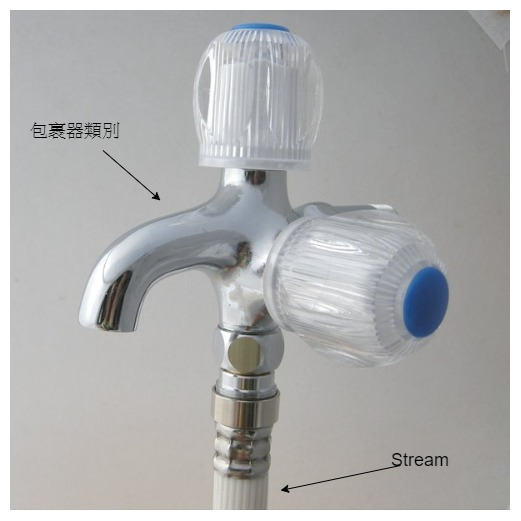

# 串流裝飾器（包裹器）

<br>

`InputStream`、`OutputStream` 提供串流基本操作，如果想要 IO 進行高階處理，則需要用到包裹器類別。

甚麼是包裹器類別 ? `Scanner` 就是一種 `InputStream` 的包裹器類別，實例化時如下：　

```java
Scanner scanner = new Scanner(System.in);
```
把 System.in 包起來，很好理解吧 !

哈 ? 你問我為甚麼包起來喔 ! 你如果直接使用 `System.in`，會有 `hasNext()`、`nextLine()`、`nextDouble()` 之類的好用擴充方法嗎 ?

包裹器類別的作用就是這樣。單純使用 `InputStream`、`OutputStream` 功能太少，操作死板。使用包裹器類別可以大大增加 Stream 的可用性。


<br>
<br>

## 常用的包裹器類別

### 具備緩衝區作用的 : [`BufferedInputStream`、`BufferedOutputStream`](./buffered)

### 具備資料轉換作用的 :　[`DataInputStream`、`DataOutputStream`](./data)

### 具備物件序列化作用的 :　[`ObjectInputStream`、`ObjectOutputStream`](./object)

<br>

* 以上包裹器類別本身沒有改變 `InputStream`、`OutputStream` 的行為，只是在 `read()` 資料後或 `write()` 資料前多一道加工步驟而已。

* 舉個例子來說，如果 Stream 是水管的話，包裹器類別就是水龍頭、變壓器。水管單純只是傳輸資料的載體，套接給水龍頭或變壓器則可以使功能變得更加豐富多彩。

    

<br>
<br>
