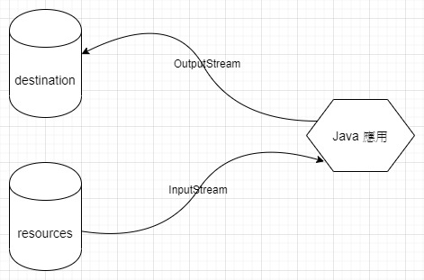

# 串流設計觀念

<br>

* 串流 （Stream）就像是水管，串接資料目的地或資料來源。

    

    想把資料從來源取出，我們要用 `InputStream`；如果要擺資料寫入目的地，我們要用 `OutputStream`。

    <br>

* 我們來直接寫一個 dump 資料的方法吧，把資料從某個來源傾倒入目的地。

    ```java
    import java.io.IOException;
    import java.io.InputStream;
    import java.io.OutputStream;

    public class Dumper {
        public static void dump(InputStream in, OutputStream out){
            try(in; out){ // AutoCloseable 物件可以這樣自動關閉資源
                byte[] data = new byte[1024]; // 嘗試每次從來源讀取 1024 bytes 資料
                int length = 0;
                while((length = in.read(data)) != -1){
                    out.write(data, 0, length);
                }
            } catch (IOException e) {
                e.printStackTrace();
            }
        }
    }
    ```

    我最早剛接觸 java 時，很搞不懂 `read()` 與 `write()` 這兩個方法怎麼做到讀寫資料的，現在雖然已經知道了，但還是說明一下吧。

    <br>

    首先我們宣告一個裝資料的盒子，大小為 1024 個 bytes

    ```java
    byte[] data = new byte[1024]
    ```

    在看一下 read 方法的 API 文件 :

    ```java
    * @param      b   讀取資料的緩衝區
    * @return     讀入緩衝區資料的大小, 如果資料到底就回傳 -1
    public int read(byte b[]) throws IOException {
        ...
    }
    ```

    當我們把盒子塞給 read，像這樣 : `read(data)`，那我們的 `InputStream` 就會讀取這個陣列大小的資料並把資料寫入 data 這個盒子中，並返回一個 int（讀取的資料長度），如果不是最後一筆資料或讀取完畢的話，一般都會返回 1024（視盒子長度大小而定）。如果已經沒有資料可以讀取，便會返回 `-1`。如此一來我們用 while 迴圈就可以讀出所有資料了。

    <br>

    查看一下 write 方法的 API　文件　:

    ```java
    * @param      b     要寫入的資料陣列
    * @param      off   資料偏移量
    * @param      len   寫入的資料長度
    
    public void write(byte b[], int off, int len) throws IOException{
        ...
    }
    ```
    `off` 參數是偏移量，簡單說就是從 b 陣列的第幾個開寫。

    `len` 參數就是寫入的長度要幾個 bytes。

    <br>

* 使用 `dump()` 法 :

    ```java
    InputStream in = new FileInputStream("D:/buffer/logger.py");
    OutputStream out = new FileOutputStream("D:/buffer/copy_of_logger.py");
    Dumper.dump(in, out);
    ```

    存一個網頁 :

    ```java
    URL url = new URL("https://www.google.com.tw");
    InputStream in = url.openStream();
    OutputStream out = new FileOutputStream("D:/buffer/google.html");
    Dumper.dump(in, out);
    ```
