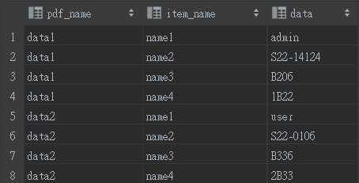

# MYSQL 把多筆資料合併成一筆 `GROUP_CONCAT()`

<br>

---

<br>

有一長表長這樣：

<br>



<br>

想要做一個 `SELECT` 變成這樣：

<br>


| pdf_name | values |
| :------: | :-----:|
| data1    | [name1: admin,name2: S22-14124,name3: B206,name4: 1B22] |
| data2    | [name1: user,name2: S22-0106,name3: B336,name4: 2B33] |

<br>

語法如下：

<br>

```sql
SELECT pdf_name, CONCAT(
    '[',
    GROUP_CONCAT(item_name, ': ', data),
    ']'
    ) AS value 
    
FROM product 
GROUP BY pdf_name
```

