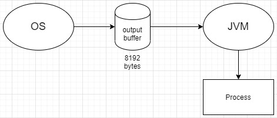

# Java 命令列呼叫 -> Runtime Process

<br>

-----------------------

<br>

## 簡介

在實習階段遇到一個問題，需要使用 java 呼叫 python 直譯器執行 .py 文件。實作過程遇到很多為題，這邊統一整理一下。

<br>
<br>


## 問題

* 首先，我們需要使用到一個 Runtime 類別的 exec( ) 方法 `Runtime.getRuntime().exec()` 來執行 cmd 命令。此方法會返回一個 `Process` 物件來提供我們指令執行期間的資訊。

    我們先直接時做一個最基本的 Python 迴圈 :

    logger.py : 

    ```py
    from time import sleep

    if __name__ == '__main__':
        for i in range(10):
            print("第 {} 次迴圈...".format(i+1))
            sleep(1)
    ```

    <br>

    然後再來編寫我們 java 部分 : 

    ```java
    public class Test {
        private static final String CMD = "python D:/buffer/logger.py";
        private static final Charset WIN32_CHARSET = Charset.forName("cp950");  // Windows OS 的系統預設編碼是 cp950。

        public static void main(String[] args) throws IOException, InterruptedException {
            Process process = Runtime.getRuntime().exec(CMD);

            System.out.println("執行成功");

            try (BufferedReader printerReader = new BufferedReader(new InputStreamReader(process.getInputStream(), WIN32_CHARSET));
                BufferedReader errorReader = new BufferedReader(new InputStreamReader(process.getErrorStream()))) {

                printerReader.lines().forEach(msg -> {
                    System.out.println("python console : " + msg);
                });

                errorReader.lines().forEach(msg -> {
                    System.out.println("python error : " + msg);
                });
            }
        }
    }
    ```

    console :

    ```bash
    執行成功
    python console : 第 1 次迴圈...
    python console : 第 2 次迴圈...
    python console : 第 3 次迴圈...
    python console : 第 4 次迴圈...
    python console : 第 5 次迴圈...
    python console : 第 6 次迴圈...
    python console : 第 7 次迴圈...
    python console : 第 8 次迴圈...
    python console : 第 9 次迴圈...
    python console : 第 10 次迴圈...

    Process finished with exit code 0
    ```

    以上執行過後，我們可以看到馬上印出 "執行成功"，過了 10 秒後才把 python 執行結果印出。突然發現問題好像很多齁...

    那就整理一下遇到的問題吧 : 

    1. 當 `exec()` 執行 cmd 命令時，主進程並不會主動等待，而是直接往下執行。

    2. java 透過 `process.getInputStream()` 所印出的 Log 資訊，是在執行結束時才印出，並不是及時的。


<br>
<br>

## 解決問題 1 

* `exec()` 非阻塞，其實也不能怪 java，畢竟都去系統呼叫了嘛，cmd 裡的事情也不歸 java 管，java 就像是充當我們 User 的角色，只管給系統命令，並且拿 console 資訊。

* 要想 `exec()` 阻塞當前進程，我們要做的其實很簡單，只需要使用 `process.waitFor()` 即可。

    ```java
    ...

    Process process = Runtime.getRuntime().exec(CMD);
    int exitCode = process.waitFor();
    System.out.println("執行成功，exitCode : " + exitCode);

    ...
    ```

    當呼叫 `process.waitFor()` 時，java __會阻塞當前進程__，等待系統發給我們一個 __exitCode__，寫過 C/C++ 的人都知道，寫 main func 的習慣都會返回一個 int（非 0 既 1）。0 就是正常執行完畢，1 就是發生了例外，非正常退出。

    當我們拿到　exitCode　時，也就代表系統呼叫執行完畢，`waitFor()` 返回 exitCode 後會釋放當前進程。

    問題解決 ! 看完整文件按這裡 :　[Main.java](./sol_p1/Main.java)

<br>
<br>

## 解決問題 2 

* 第二個問題牽扯到的東西就比較複雜了，首先我們要先釐清一點，因為我們上邊解決問題 1 時已經設計成阻塞式了，所以讀取 console 的 InputStream 照理說本來就是會在最後執行。但是我們想要的是動態印出，所以馬上想到開 Thread 去做。

<br>

* 先實作一個用來讀取資訊的 Runnable 物件吧 :

    ConsoleReader.java

    ```java
    import java.io.BufferedReader;
    import java.io.IOException;
    import java.io.InputStream;
    import java.io.InputStreamReader;
    import java.nio.charset.Charset;

    public class ConsoleReader implements Runnable {
        private static Charset sysCharset = Charset.forName("cp950");
        private InputStream console;

        public ConsoleReader(InputStream console){
            this.console = console;
        }

        @Override
        public void run() {
            try(BufferedReader reader = new BufferedReader(new InputStreamReader(console, sysCharset))){
                reader.lines().forEach(msg ->{
                    System.out.println("console : " + msg);
                });
            } catch (IOException e) {
                e.printStackTrace();
            }
        }
    }
    ```

    <br>

    Main.java

    ```java
    import java.io.IOException;
    import java.nio.charset.Charset;

    public class Main {
        private static final String CMD = "python D:/buffer/logger.py";
        private static final Charset WIN32_CHARSET = Charset.forName("cp950");

        public static void main(String[] args) throws IOException, InterruptedException {
            Process process = Runtime.getRuntime().exec(CMD);

            new Thread(new ConsoleReader(process.getInputStream())).start();
            new Thread(new ConsoleReader(process.getErrorStream())).start();

            int exitCode = process.waitFor();
            System.out.println("exitCode : " + exitCode);
        }
    }
    ```

    以上一開始我覺得應該沒什麼問題，但是執行起來一下，console 還是沒有既時印出。

    <br>

* 為了解決這個問題，我查了一些資料，首先要理解的是，OS 平台原生的 output buffer。

    每一個 OS 平台在處理這方面的系統呼叫時，都會有一個專屬的 console output 緩衝區，就 Windows OS 而言，這個緩衝區大小為 8192 bytes。當我們的訊息超出了這個 size 就會被系統 flash 掉（也就被我們的 java 的 Process 讀取）示意圖如下 :

    

    也就說，如果我們 python 的一次輸出不滿 8192 bytes 大小，就不會被系統的 buffer 沖掉，JVM 也就並不知道有 console 輸出出來。

    <br>

* 為了解決這個問題，我打算從 python `print()` 以及 java 的設計上動動手腳。

    修改 logger.py : 

    ```py
    import platform
    import sys

    from time import sleep

    # 自訂的 print() 函式會自動幫我們加 8191 個空格
    def print(*args):
        msg = ''
        for d in args:
            msg += str(d)

        if (platform.system().__eq__("Windows")):
            msg += "\n"
        else:
            msg += "\r\n"

        msg += " "*8191
        sys.stdout.write(msg)

    if __name__ == '__main__':
        for i in range(10):
            print("第 {} 次迴圈...".format(i+1))
            sleep(1)
    ```

    <br>

    java 部分比較沒有那麼複雜，只要在每行訊息印出時做一次 `strip()` 就可以了

    ```java
    ...
    reader.lines().forEach(msg ->{
                    System.out.println("console : " + msg.strip());
                });
    ...
    ```

    這樣一來，我們的需求就完美達成了 !

    看完整範例請點這裡 : 

    * [Main.java](./sol_p2/Main.java)

    * [ConsoleReader.java](./sol_p2/ConsoleReader.java)

    * [logger.py](./sol_p2/logger.py)

