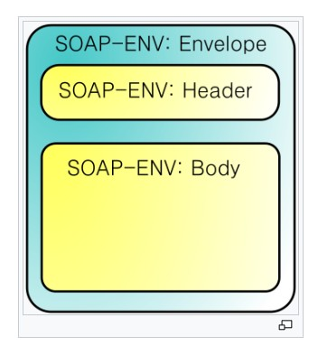

# 發送 SOAP 請求

<br>

---

<br>

一些老舊的系統還在使用 __SOAP（簡單物件存取協定）__ 進行資料交互。

SOAP 簡單來說是交換資料的一種協定規範，SOAP為了簡化 Web Server 從 XML 資料庫中提取資料時，節省去格式化頁面時間，以及不同應用程式之間按照HTTP通信協定，__遵從　XML 格式執行資料互換__。

SMTP 以及 HTTP 協定都可以用來傳輸 SOAP 訊息，用 XML 資料格式傳輸。

<br>

看一下 SOAP 的資料結構

<br>

`Envelope` 裡包 `Header` 與 `Body`：




<br>

SOAP 訊息 xml 範例長這樣：


<br>

### 請求：

```xml
<soapenv:Envelope
	xmlns:soapenv="http://schemas.xmlsoap.org/soap/envelope/"
	xmlns:xsd="http://www.w3.org/2001/XMLSchema"
	xmlns:xsi="http://www.w3.org/2001/XMLSchema-instance">
	<soapenv:Body>
		<req:echo xmlns:req="http://localhost:8080/wxyc/login.do">
			<req:category>classifieds</req:category>
		</req:echo>
	</soapenv:Body>
</soapenv:Envelope>
```

<br>

### 回應：

```xml
<soapenv:Envelope
	xmlns:soapenv="http://schemas.xmlsoap.org/soap/envelope/"
	xmlns:wsa="http://schemas.xmlsoap.org/ws/2004/08/addressing">
	<soapenv:Header>
		<wsa:ReplyTo>
			<wsa:Address>http://schemas.xmlsoap.org/ws/2004/08/addressing/role/anonymous</wsa:Address>
		</wsa:ReplyTo>
		<wsa:From>
			<wsa:Address>http://localhost:8080/axis2/services/MyService</wsa:Address>
		</wsa:From>
		<wsa:MessageID>ECE5B3F187F29D28BC11433905662036</wsa:MessageID>
	</soapenv:Header>
	<soapenv:Body>
		<req:echo xmlns:req="http://localhost:8080/axis2/services/MyService/">
			<req:category>classifieds</req:category>
		</req:echo>
	</soapenv:Body>
</soapenv:Envelope>
```

<br>
<br>
<br>
<br>

下面做一個 Java 訪問範例：

<br>


```java
import javax.xml.soap.*;

public class SOAPClientSAAJ {

    // SAAJ - SOAP Client Testing
    public static void main(String args[]) {
        /*
            以下範例訪問的 Web Service url 如下：
             http://www.webservicex.net/uszip.asmx?op=GetInfoByCity


            呼叫 Web Service,需要 2 組 url:
             - SOAP Endpoint URL (SOAP 服務的 url)
             - SOAP Action (訪問的功能)

         */
        String soapEndpointUrl = "http://www.webservicex.net/uszip.asmx";
        String soapAction = "http://www.webserviceX.NET/GetInfoByCity";

        callSoapWebService(soapEndpointUrl, soapAction);
    }

    private static void createSoapEnvelope(SOAPMessage soapMessage) throws SOAPException {
        SOAPPart soapPart = soapMessage.getSOAPPart();

        String myNamespace = "myNamespace";
        String myNamespaceURI = "http://www.webserviceX.NET";

        // SOAP Envelope
        SOAPEnvelope envelope = soapPart.getEnvelope();
        // 加入自訂義 namespace，如果不需要就不用加。
        envelope.addNamespaceDeclaration(myNamespace, myNamespaceURI);

            /*
            建構 SOAP Request Message 如下:
            <SOAP-ENV:Envelope xmlns:SOAP-ENV="http://schemas.xmlsoap.org/soap/envelope/" xmlns:myNamespace="http://www.webserviceX.NET">
                <SOAP-ENV:Header/>
                <SOAP-ENV:Body>
                    <myNamespace:GetInfoByCity>
                        <myNamespace:USCity>New York</myNamespace:USCity>
                    </myNamespace:GetInfoByCity>
                </SOAP-ENV:Body>
            </SOAP-ENV:Envelope>
            */

        // SOAP Body
        SOAPBody soapBody = envelope.getBody();
        SOAPElement soapBodyElem = soapBody.addChildElement("GetInfoByCity", myNamespace);
        SOAPElement soapBodyElem1 = soapBodyElem.addChildElement("USCity", myNamespace);
        soapBodyElem1.addTextNode("New York");
    }

    private static void callSoapWebService(String soapEndpointUrl, String soapAction) {
        try {
            // 建立 SOAP Connection
            SOAPConnectionFactory soapConnectionFactory = SOAPConnectionFactory.newInstance();
            SOAPConnection soapConnection = soapConnectionFactory.createConnection();

            // 建立 SOAP Message (裡面包含 SOAP Envelope)
            SOAPMessage soapMessage = createSOAPRequest(soapAction);

            // 發送 SOAP Message 到 SOAP Server
            SOAPMessage soapResponse = soapConnection.call(soapMessage, soapEndpointUrl);

            // 印出 SOAP Response
            System.out.println("Response SOAP Message:");
            soapResponse.writeTo(System.out);
            System.out.println();

            // 關閉 SOAP Connection
            soapConnection.close();
        } catch (Exception e) {
            System.err.println("\nError occurred while sending SOAP Request to Server!\nMake sure you have the correct endpoint URL and SOAPAction!\n");
            e.printStackTrace();
        }
    }

    private static SOAPMessage createSOAPRequest(String soapAction) throws Exception {
        MessageFactory messageFactory = MessageFactory.newInstance();
        SOAPMessage soapMessage = messageFactory.createMessage();

        // 建立 SOAP Envelope 並放入 SOAP Message 中
        createSoapEnvelope(soapMessage);

        // 建構 MimeHeader
        MimeHeaders headers = soapMessage.getMimeHeaders();
        headers.addHeader("SOAPAction", soapAction);

        // 保存 Message 設定
        soapMessage.saveChanges();

        /* 印出 request message */
        System.out.println("Request SOAP Message:");
        soapMessage.writeTo(System.out);
        System.out.println("\n");

        return soapMessage;
    }

}
```

<br>

